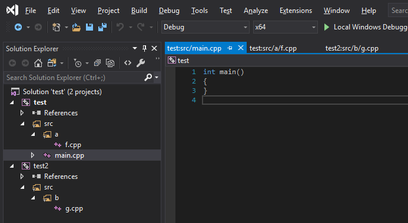
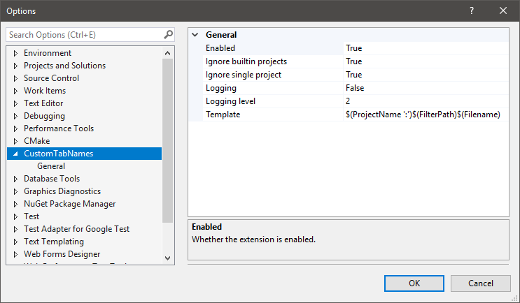

This extension allows for changing the caption on editor tabs based on a template. The template can be changed in the Options, under the item "CustomTabNames".

## Template
The template is made of variables with the form `$(VariableName)`. Those are replaced by the appropriate value. Anything outside variables is kept verbatim.

Variables can also contain a single-quoted string: `$(VariableName 'string')`. The string will be appended to the variable expansion if it is not empty. This is useful for putting a separator only if the variable is not empty. For example, `$(ProjectName):$(Filename)` will expand to `project:file.ext` if the file is in a project, but to `:file.exe` if it's not. Putting the colon inside the variable name fixes it: `$(ProjectName ':')$(Filename)` expands to `file.exe` if the file is not in a project.

## Variables
These variables can be used in the template:

#### `ProjectName`
Name of the project that owns the document. Can be empty if the option to ignore single projects is enabled.

#### `ParentDir`
Name of the parent directory of the document, includes a terminating `/` if not empty.

#### `Filename`
Filename of the document.

#### `FullPath`
Full path of the document.

#### `FilterPath`
All the parent filters ("folders") for the document are joined, separated with `/`. This does not include the project name, nor the filename. Can be empty if the file is directly a child of a project.

#### `ParentFilter`
Parent filter of the document. Can be empty if the file is directly a child of a project.

## Options
Options are under the item 'CustomTabNames' in the Options dialog.

#### Enabled
If false, all tabs are restored to showing the filename. Defaults to `true`.

#### Ignore built-in projects
Some items are under dummy projects. For example, opening a file that's not in the solution puts it under a project named "Miscellaneous files", which would appear with `$(ProjectName)`. When `true`, these dummy projects are ignored and `$(ProjectName)` will expand to an empty string. Defaults to `true`.

#### Ignore single project
Doesn't expand `$(ProjectName)` if there's only one project in the solution. Defaults to `true`.

#### Logging
If true, a new entry "CustomTabNames" is created in the Output window with logs from this extension. Defaults to `false`.

#### LoggingLevel
Sets the maximum level to log. 0=Error, 1=Warn, 2=Log, 3=Trace 4=Variable expansions. Ignored if `Logging` is `false`. Defaults to 2 (Log).

#### Template
The template string used to generate captions. Defaults to `$(ProjectName ':')$(FilterPath)$(Filename)`.

## Building
Clone the project, open `CustomTabNames.sln`, build with the Release configuration. Open `bin/Release/CustomTabNames.vsix`, select the appropriate Visual Studio versions, and install. Tested on 2017 and 2019.

## License
CC0 1.0 Universal. This project is in the public domain.
